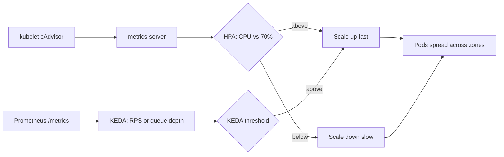

# Design

## Scaling strategy

The chart scales data-sync with a `HorizontalPodAutoscaler` (`autoscaling/v2`) on CPU
utilization: staging stays on a fixed `replicaCount`, production runs `minReplicas: 3` to
`maxReplicas: 20` at 70 percent CPU, computed against the CPU *request* (`cpu: "2"`), never
the limit (`cpu: "4"`, `docs/DECISIONS.md` #5). Scale-up reacts within 15 seconds (a large
percent-based step); scale-down is deliberately slow (5-minute stabilization), so a brief
spike does not thrash pods.

CPU-based HPA alone cannot reliably get scale-out under 20 seconds: the metrics-server poll
interval (about 15 seconds) plus image pull and startup-probe time puts a floor around 30 to
90 seconds. Two changes close that gap for the 2,000 req/s burst in the scenario:

- **Pre-warm the floor.** Raise `minReplicas` to steady-state peak traffic, so bursts are
  absorbed by already-Ready pods instead of waiting on the scale-out path. Cost: idle
  capacity paid for around the clock.
- **Scale on a leading indicator with KEDA.** Add a KEDA `ScaledObject` next to the HPA,
  scaling on request rate or Redis queue depth instead of CPU. Those metrics rise before CPU
  does, since a queued request uses little CPU until a worker picks it up, so KEDA reacts to
  the cause of the burst, not its downstream effect. Cost: another operator and metrics
  pipeline to keep healthy, and a second scaling signal to reason about.

Together: pre-warmed `minReplicas` absorbs the first seconds, KEDA covers the rest of the
ramp, and CPU-based HPA is the fallback if the metrics pipeline is down.

Scaling out also multiplies Redis connections: 20 pods x `WORKERS=4` x `MAX_CONNECTIONS=100`
is 8,000, against a Redis default `maxclients` of 10,000. Raise `maxclients` or pool through a
proxy before raising `maxReplicas`.



## Workload isolation

For the ClickHouse noisy-neighbor case, isolation starts with scheduling, not security
hardening. Taint the nodes ClickHouse runs on with something like
`workload=analytics:NoSchedule`; give data-sync a matching `toleration` only where it should
share a node, and `nodeAffinity`/`nodeSelector` (chart values, currently empty) to pin it
elsewhere. A `priorityClassName` above ClickHouse's own means the kubelet evicts the batch
workload first under real node pressure, not the request-serving one. A namespace-level
`ResourceQuota` and `LimitRange` stop any workload requesting past what a node has.

Memory `requests == limits` still protects data-sync from eviction if ClickHouse's memory use
pushes the node into pressure; the CPU limit sits above the request (`docs/DECISIONS.md` #5),
so CPU-side protection comes from the taint and priority class above, not QoS class. Topology
spread bounds blast radius: replicas land across zones rather than piling onto free nodes, so
a zone outage costs at most a third of the fleet, and the PDB stops maintenance compounding
that.

Decision rule for a **dedicated node pool**: stay on tainted shared nodes while taints,
priority classes and quotas keep p99 latency stable. Move once contention still shows up in
p99 despite that, or once data-sync's own footprint makes paying for its own idle headroom
cheaper than the latency risk of sharing.

```text
Zone A            Zone B            Zone C
┌─────────┐       ┌─────────┐       ┌─────────┐
│ pod-1   │       │ pod-2   │       │ pod-3   │
└─────────┘       └─────────┘       └─────────┘
     one zone lost -> PDB still guards minAvailable
     across the two that remain
```

## Zero-downtime secret rotation

The new password is pulled from Secret Manager by the deploy pipeline and passed with
`--set-string secret.redisPassword=...`, or synced into an `existingSecret` by External
Secrets Operator on a 90-day schedule. No plaintext is committed. Two gaps have to close, not
one.

**Redis must accept both passwords at once.** A rolling update runs old and new pods side by
side for a minute or two. Legacy `requirepass` sets a single password on the `default` user,
so the moment it changes, one cohort fails to authenticate. A Redis ACL user can hold several:
"Every user can have any number of passwords." Rotation becomes add, roll, then drop:
`ACL SETUSER data-sync >new`, roll the Deployment, confirm nothing still uses the old
password, then `ACL SETUSER data-sync <old` and `ACL SAVE`. Rollback stays safe until that
last step, because the old password still works until it is explicitly removed.

**The pods must notice.** Kubernetes does not restart a Deployment when a Secret changes, so
editing the Secret alone leaves pods holding the old value. `deployment.yaml` sets
`checksum/config` and `checksum/secret` on the pod template from a SHA-256 of the rendered
ConfigMap and Secret. Helm computes that hash only at template time, so the Kustomize
overlay's `replacements` block copies the rendered `checksum/secret` into a second
`SECRET_CHECKSUM` annotation, keeping the behaviour through the overlay. That hash exists only
when the chart renders the Secret. Under `existingSecret`, External Secrets updates it in
place, nothing changes the pod template, and that path needs a watcher like Reloader.

Because the annotation lives on the pod template, changing it changes the template hash and
triggers a normal rolling update: new pods start, pass readiness, and only then do old pods
terminate, respecting `maxUnavailable`. The Service routes only to Ready pods, so no traffic
gap opens. Verify with `kubectl rollout status`, no pods left in `CrashLoopBackOff`, and flat
Redis `rejected_connections` and error-rate panels throughout.
