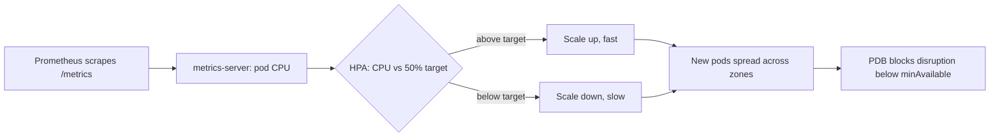
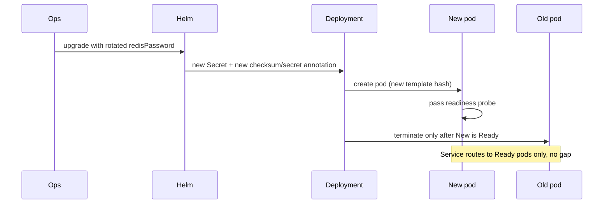

# Design

## Scaling strategy

The chart scales data-sync with a `HorizontalPodAutoscaler` (`autoscaling/v2`) on CPU
utilization, gated behind `autoscaling.enabled` so staging can stay on a fixed
`replicaCount` while production runs `minReplicas: 3` to `maxReplicas: 20` at 50 percent CPU
target. `replicas` is omitted from the Deployment whenever autoscaling is on, so Helm never
fights the HPA over the field on every `upgrade`. Requests equal limits in production
(`cpu: "2"`, `memory: 2Gi`), giving every pod Guaranteed QoS: the kubelet will not throttle or
evict data-sync ahead of lower-priority workloads, and the HPA's CPU percentage means what it
says because there is no burst headroom hiding above the request.

Production sets asymmetric scaling behavior: scale-up reacts in under a minute (a short
stabilization window, a large percent-based step), scale-down is deliberately slow (a long
stabilization window, a small step), so a brief traffic spike does not thrash pods up and
immediately back down. `PodDisruptionBudget` (`minAvailable`) and topology spread
(`maxSkew: 1`, zone `topologyKey`, `whenUnsatisfiable: DoNotSchedule`) sit underneath the HPA
so that scaling and voluntary disruption never drop capacity below what one zone failure
should be able to absorb.



## Workload isolation

Isolation runs on three axes: identity, filesystem, and blast radius. The container runs as
a fixed non-root UID with `readOnlyRootFilesystem: true`, `allowPrivilegeEscalation: false`,
all Linux capabilities dropped, and a `RuntimeDefault` seccomp profile; the only writable
path is an `emptyDir` mounted at `/tmp`. The ServiceAccount has
`automountServiceAccountToken: false`, since data-sync never calls the Kubernetes API. None
of this is defense against a specific known exploit; it is the standard baseline that removes
whole exploit classes (privilege escalation, root-owned file tampering, credential theft from
a mounted token) at negligible cost.

Blast radius is bounded at the scheduling layer. Topology spread constraints keep replicas
across zones instead of letting the scheduler pack them onto whichever nodes are free, so one
zone's outage removes at most a third of the fleet rather than all of it. The PDB then stops
cluster maintenance (node drains, cluster upgrades) from removing more replicas than that on
top of a real outage. Requests and limits keep one pod from starving its neighbors on a
shared node; per-environment `values.yaml` files keep staging and production fully separate
releases, namespaces and Secrets, so a bad staging config change has no path to production.

```text
Zone A            Zone B            Zone C
┌─────────┐       ┌─────────┐       ┌─────────┐
│ pod-1   │       │ pod-2   │       │ pod-3   │
│ 2 CPU   │       │ 2 CPU   │       │ 2 CPU   │
│ Guaran. │       │ Guaran. │       │ Guaran. │
└─────────┘       └─────────┘       └─────────┘
     one zone lost -> PDB still guards minAvailable
     across the two that remain
```

## Zero-downtime secret rotation

Kubernetes never restarts a Deployment just because a mounted Secret changed, so a naive
rotation edits the Secret and the running pods keep the old value in memory indefinitely. The
chart closes that gap with a checksum annotation: `deployment.yaml` sets
`checksum/config` and `checksum/secret` on the pod template from a SHA-256 of the rendered
ConfigMap and Secret. Helm only computes SHA-256 at template time, so the Kustomize overlay
cannot copy the hash function; instead its `replacements` block copies the already-rendered
`checksum/secret` annotation into a second `SECRET_CHECKSUM` annotation on the same pod
template, which is enough to prove the value tracks the Secret through the overlay too.

Because the annotation lives on the pod template, not the Deployment's own metadata, changing
it changes the template hash, which is exactly what triggers a normal Kubernetes rolling
update: new pods with the new Secret value start first, pass their readiness probe, and only
then do old pods terminate, respecting `maxUnavailable` the whole way. No pod is ever running
with a mixed or stale Secret and no traffic gap opens up, because the Service keeps routing to
whichever pods are Ready throughout.


