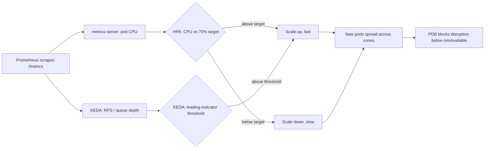
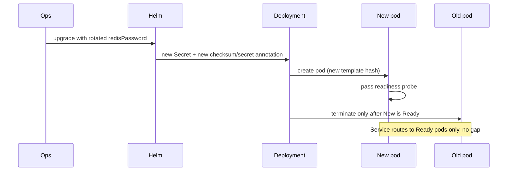

# Design

## Scaling strategy

The chart scales data-sync with a `HorizontalPodAutoscaler` (`autoscaling/v2`) on CPU
utilization: staging stays on a fixed `replicaCount`, production runs `minReplicas: 3` to
`maxReplicas: 20` at 70 percent CPU with requests equal to limits (`cpu: "2"`, `memory: 2Gi`)
for Guaranteed QoS, so 70 percent means what it says with no burst headroom above the
request. Scale-up reacts within 15 seconds (a large percent-based step); scale-down is
deliberately slow (5-minute stabilization), so a brief spike does not thrash pods up and
back down.

CPU-based HPA alone cannot reliably get scale-out under 20 seconds: the metrics-server poll
interval (about 15 seconds) plus image pull and startup-probe time puts a floor around 30 to
90 seconds, since the HPA cannot react to load it has not measured yet. Two changes close
that gap for the 2,000 req/s burst in the scenario:

- **Pre-warm the floor.** Raise `minReplicas` to steady-state peak traffic, so bursts are
  absorbed by already-Ready pods instead of waiting on the scale-out path. Cost: idle
  capacity paid for around the clock.
- **Scale on a leading indicator with KEDA.** Add a KEDA `ScaledObject` next to the HPA,
  scaling on request rate or Redis queue depth instead of CPU. Those metrics rise before CPU
  does, since a queued request uses little CPU until a worker picks it up, so KEDA reacts to
  the cause of the burst, not its downstream effect. Cost: another operator and metrics
  pipeline to keep healthy, and a second scaling signal to reason about.

Together: pre-warmed `minReplicas` absorbs the first seconds, KEDA covers the rest of the
ramp, and CPU-based HPA remains the fallback if the metrics pipeline is down.



## Workload isolation

For the ClickHouse noisy-neighbor case, isolation starts with scheduling, not security
hardening. Taint the nodes ClickHouse runs on with something like
`workload=analytics:NoSchedule`; give data-sync a matching `toleration` only where it should
share a node, and `nodeAffinity`/`nodeSelector` (already chart values, currently empty) to
pin it elsewhere. A `priorityClassName` above ClickHouse's own means the kubelet evicts the
batch workload first under real node pressure, not the request-serving one. A namespace-level
`ResourceQuota` and `LimitRange` back this up so no workload can request past what a node
actually has.

Requests equal to limits (Guaranteed QoS) also stop data-sync from being throttled or evicted
first if ClickHouse bursts past its own limits. Topology spread bounds blast radius the same
way: replicas land across zones instead of piling onto free nodes, so a zone outage removes
at most a third of the fleet, and the PDB stops maintenance from taking more than that on top
of a real outage.

Decision rule for a **dedicated node pool**: stay on tainted shared nodes while taints,
priority classes and quotas keep p99 latency stable. Move once contention still shows up in
p99 despite that, or once data-sync's own footprint makes paying for its own idle headroom
cheaper than the latency risk of sharing.

```text
Zone A            Zone B            Zone C
┌─────────┐       ┌─────────┐       ┌─────────┐
│ pod-1   │       │ pod-2   │       │ pod-3   │
│ 2 CPU   │       │ 2 CPU   │       │ 2 CPU   │
│ Guaran. │       │ Guaran. │       │ Guaran. │
└─────────┘       └─────────┘       └─────────┘
     one zone lost -> PDB still guards minAvailable
     across the two that remain
```

## Zero-downtime secret rotation

The new password arrives the same way the first one did: pulled from Secret Manager by the
deploy pipeline and passed with `--set-string secret.redisPassword=...`, or synced into an
`existingSecret` by External Secrets Operator on a 90-day schedule. No plaintext is ever
committed.

Kubernetes never restarts a Deployment when a mounted Secret changes, so editing the Secret
alone leaves running pods holding the old value. The chart closes that gap with a checksum
annotation: `deployment.yaml` sets `checksum/config` and
`checksum/secret` on the pod template from a SHA-256 of the rendered ConfigMap and Secret.
Helm only computes that hash at template time, so the Kustomize overlay's `replacements`
block instead copies the already-rendered `checksum/secret` annotation into a second
`SECRET_CHECKSUM` annotation on the same pod template, proving the value tracks the Secret
through the overlay too.

Because the annotation lives on the pod template, changing it changes the template hash,
triggering a normal rolling update: new pods with the new value start first, pass readiness,
and only then do old pods terminate, respecting `maxUnavailable`. No pod runs with a stale
Secret and no traffic gap opens, since the Service only routes to Ready pods. To verify:
`kubectl rollout status` reaches "successfully rolled out", `kubectl -n data-sync get pods`
shows only new pods left with none in `CrashLoopBackOff`, and the Prometheus error-rate panel
for data-sync stays flat throughout.


